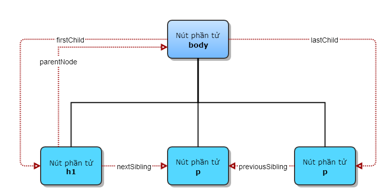
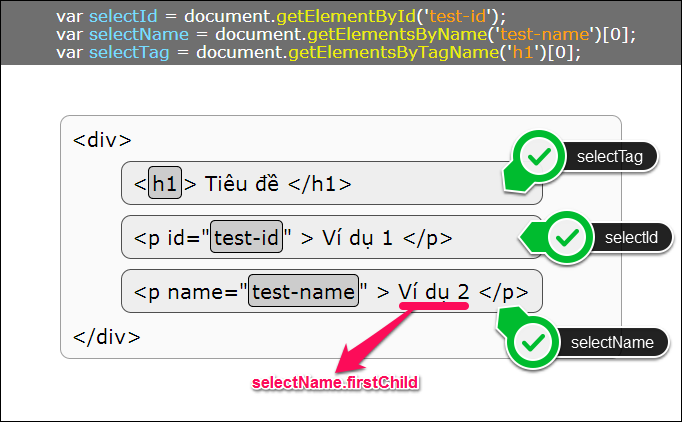

# DOM
Theo W3C, DOM là một nền tảng, giao diện cho phép chương trình và đoạn mã tự động truy cập, cập nhập nội dung, cấu trúc, style của tài liệu
Nói một cách khác, khi một trang web được load, trình duyệt sẽ tạo ra DOM của trang đó dưới dạng cây dữ liệu.
## D (Document)
DOM không thể hoạt động nếu không có một document. Khi tạo ra một trang web và tải nó vào trình duyệt, DOM sẽ bắt đầu làm việc. Nó nhận tài liệu đã viết và chuyển nó thành một đối tượng.

## O (Object)
Trong Javascript có 3 loại đối tượng:
- Đối tượng do người dùng định nghĩa được tạo ra bởi lập trình viên. 
- Các đối tượng của ngôn ngữ lập trình như Array, Math, Date
- Đối tượng môi trường được cung cấp bởi trình duyệt.

Đối tượng cơ bản nhất là window, thể hiện cho cửa sổ web. Nhưng chúng ta sẽ không quan tâm nhiều tới nó mà quan tâm tới những gì trong cửa số đó, là document

## M (Model)
M tức là mô hình (model) hãy cũng có thể hiểu là bản đồ (map). Trình duyệt  cung cấp bản đồ của trang. Và chúng ta dung JS để đọc bản đồ đó, và bản đồ này được thể hiện dưới dạng cây phả hệ.

Javascript có 8 loại DOM để chúng ta thao tác:

## Cấu trúc cây DOM
### NÚT
Đối với HTML DOM, mọi thành phần đều được xem là 1 nút (node), được biểu diễn trên 1 cây cấu trúc dạng cây gọi là DOM Tree. Các phần tử khác nhau sẽ được phân loại nút khác nhau nhưng quan trọng nhất là 3 loại: nút gốc (document node), nút phần tử (element node), nút văn bản (text node).
- Nút gốc: chính là tài liệu HTML, thường được biểu diễn bởi thẻ.
- Nút phần tử: biểu diễn cho 1 phần tử HTML.
- Nút văn bản: mỗi đoạn kí tự trong tài liệu HTML, bên trong 1 thẻ HTML đều là 1 nút văn bản. Đó có thể là tên trang web trong thẻ, tên đề mục trong thẻ , hay một đoạn văn trong thẻ.
Ngoài ra còn có nút thuộc tính (attribute node) và nút chú thích (comment node).

#### Quan hệ giữa các nút
- Nút gốc (document) luôn là nút đầu tiên.
- Tất cả các nút không phải là nút gốc đều chỉ có 1 nút cha (parent).
- Một nút có thể có một hoặc nhiều con, nhưng cũng có thể không có con nào.
- Những nút có cùng nút cha được gọi là các nút anh em (siblings).
- Trong các nút anh em, nút đầu tiên được gọi là con cả (firstChild) và nút cuối cùng là con út (lastChild).
### Truy xuất DOM
1. Truy xuất gián tiếp

Mỗi nút trên cây DOM đều có 6 thuộc tính quan hệ để giúp bạn truy xuất gián tiếp theo vị trí của nút:

- Node.parentNode: tham chiếu đến nút cha của nút hiện tại, và nút cha này là duy nhất cho mỗi nút. Do đó, nếu bạn cần tìm nguồn gốc sâu xa của 1 nút, bạn phải nối thuộc tình nhiều lần, ví dụ Node.parentNode.parentNode.
- Node.childNodes: tham chiếu đến các nút con trực tiếp của nút hiện tại, và kết quả là 1 mảng các đối tượng. Lưu ý rằng, các nút con không bị phân biệt bởi loại nút, nên kết quả mảng trả về có thể bao gồm nhiều loại nút khác nhau.
- Node.firstChild: tham chiếu đến nút con đầu tiên của nút hiện tại, và tương đương với việc gọi Node.childNodes[0].
- Node.lastChild: tham chiếu đến nút con cuối cùng của nút hiện tại, và tương đương với việc gọi Node.childNodes[Element.childNodes.length-1].
- Node.nextSibling: tham chiếu đến nút anh em nằm liền kề sau với nút hiện tại.
- Node.previousSibling: tham chiếu đến nút anh em nằm liền kề trước với nút hiện tại.

2. Truy xuất trực tiếp
Truy xuất trực tiếp sẽ nhanh hơn, và đơn giản hơn khi bạn không cần phải biết nhiều về quan hệ và vị trí của nút. Có 3 phương thức để bạn truy xuất trực tiếp được hỗ trợ ở mọi trình duyệt:

#### Tạo thêm hoặc di chuyển DOM với appendChild
Như bạn đã biết, mọi nút trên cây cấu trúc DOM đều bắt nguồn sâu xa từ nút gốc và bắt buộc phải có 1 nút cha. Do đó, về bản chất, khi 1 DOM mới được tạo ra, nó cô đơn 1 mình và không thể sử dụng được như các phần tử DOM thông thường. Chỉ sau khi bạn tìm 1 nút khác trên cây DOM để làm cha đứa bé thì quá trình tạo thêm DOM hoàn tất. Nếu bạn đã sẵn sàng để tạo vài em bé thì hãy cùng nhau tạo vài nút mới với 2 phương thức sau:

- **document.createElement(tên_thẻ_html)**: tạo 1 nút phần tử từ nút gốc.
- **document.createTextNode(chuỗi_kí_tự)**: tạo 1 nút văn bản từ nút gốc.

Khi bạn tạo 1 nút mới nhưng chưa gán nút cha cho nó, nút đó sẽ tồn tại trong bộ nhớ đệm của máy tính. Bạn sẽ không thể truy xuất đến nút đó được, trừ khi bạn đã lưu tham chiếu đến nút đó bằng 1 biến.

`Một lưu ý khi tạo thêm DOM: nút mới được tạo sẽ vẫn có các thuộc tính và phương thức như 1 nút DOM thực thụ. Tuy nhiên, các thuộc tính của nút mới sẽ ở trạng thái rỗng hoặc mặc định, nên bạn sẽ phải thiết lập thêm các thuộc tính cần thiết.`

Phương thức **appendChild** còn được sử dụng để tổ chức “tái định cư” cho các nút DOM. Nếu như 1 nút DOM đang có 1 nút cha, nhưng lại được 1 nút cha khác “nhận nuôi” thông qua appendChild thì nó sẽ cắt đút quan hệ với nút cha cũ để về bên gia đình mới.

#### Loại bỏ DOM với removeChild
Khi bạn loại bỏ 1 nút, nút đó vẫn sẽ tồn tại trong bộ nhớ đệm của máy tính. Bạn sẽ không thể truy xuất đến nút đó được nữa, trừ khi bạn đã lưu tham chiếu đến nút đó bằng 1 biến.

Khi loại bỏ DOM, nút cha sẽ sử dụng phương thức removeChild() để từ mặt 1 hoặc nhiều nút con.

### DOM EVENT

Sự kiện và các hàm xử lý sự kiện DOM là một phần quan trọng của Javascript. Sự kiện sẽ xảy ra khi có sự tương tác từ người dùng (như sự kiện onclick khi người dùng nhấn chuột , onmousemove khi chuột di chuyển..) hoặc từ chính trang web (sự kiện onload khi một phần tử DOM nào đó đã được tải xong hay khi cửa sổ bị thay đổi kích thước). Bạn có thể tham khảo thêm danh sách sự kiện rút gọn ở W3Schools hoặc danh sách đầy đủ của Mozilla.
